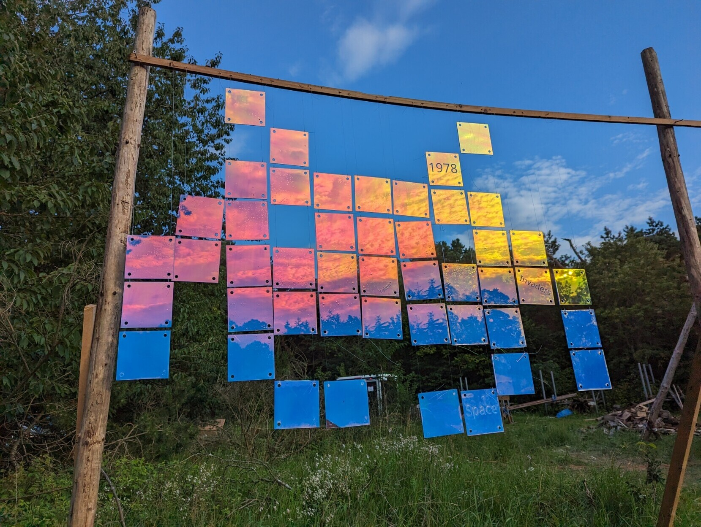
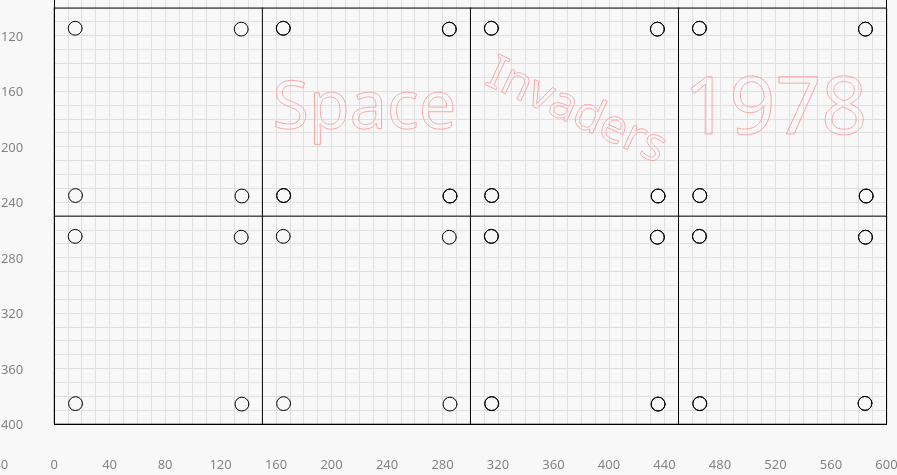
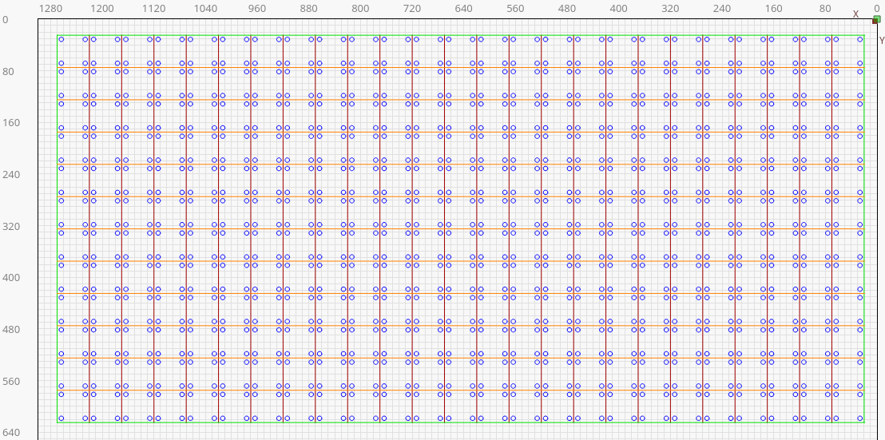

# Acrylic Rainbow Pixels

## What is this?
The Acrylic Rainbow Pixels project stem from an art project at the Hacker Camp [BornHack 2023](https://bornhack.dk/), in Denmark, where we laser cut 150 x 150 mm acrylic plates applied with dichroic film, to create the crab character from the arcade game Space Invaders (1978).

Given that this project is just a bunch of pixels, we have the flexibility to repurpose them for creating new pixel art at future events, with the main cost being the initial creation of the pixels. The pixels are easily transportable and require minimal storage and transportation space, although they weight a quite a bit relative to their size.

Day Space Invader at BornHack 2023 by Bart and Hafnium. Photo by [@Guru_san@mastodon.social](https://chaos.social/@Guru_san@mastodon.social/110842490808345178)

## Laser Files
You can find laser cut files in AutoCad DXF and [LightBurn](https://lightburnsoftware.com/) (.lbrn2) format in the [assets directory](./assets). The image below shows 150x150mm and 50x50 pixels in LightBurn for a 400x600mm (and 900x1300mm) laser cutter.

## Bill of Materials
- 3mm Acrylic plates
- Self-adhesive Dichroic film
	- Sometimes called rainbow film. You can read up on [Thin Film Filters](https://en.wikipedia.org/wiki/Dichroic_filter) for more info on how these works.
	- Material type should be PET. Beware that some sellers does not make it clear whether the material is PET or PVC. PET is find, but laser cutting PVC is dangerous for you and your laser cutter
- Transfer concentrate
	- Alternative: Glass cleaner
- Fishing wire in 0.4 - 0.6 mm

### Where to find it
- Acrylic plates
	- [Interglas.dk](https://interglas.dk/shop/akryl-klar-3-500p.html) (Brøndby, Denmark)
- Self-adhesive Dichroic film
	- [Aliexpress.com](https://www.aliexpress.com/item/1005005620190266.html) (China)
	- [Velken.shop](https://www.velken.shop/p/rainbow-color-effect-film-cold-transparent/) (Germany)
- Transfer concentrate: [Velken.shop](https://www.velken.shop/p/transfer-concentrate/) (Germany)
	- Glass cleaner: Any supermarket or hardware store
- Fishing wire: Fishing store or hardware store

## Tools Required
- Laser cutter capable of cutting 3 mm acrylic
- Spray bottle
- Microfiber cloth
- Mounting/assembly squeegee

### Where to find it:
- Assembly set: Spray bottle, microfiber cloth, transfer concentrate and squeegee
	- [Velken.shop](https://www.velken.shop/p/assembly-set-professional/) (Germany)
- Squeegee
	- [Bauhaus Denmark](https://www.bauhaus.dk/eskimo-gummispartel-200-mm)

In case your laser cutter is not adjusted correctly and/or you cut with to little power, you will have issues getting the holes out. You will need a small pointed chisel, a belt hole puncher or similar, to increase the world's entropy.

- Pointed chisel
  - Bauhaus Denmark: [Spidsmejsel](https://www.bauhaus.dk/wisent-spidsmejsel-vanadium-krom-250mm)
- Belt hole puncher
  - Bauhaus Denmark: [Hultang](https://www.bauhaus.dk/rapid-rp03-hultang-til-laeder-tekstil-og-plastik) 

## Assembly Instructions

1) Apply dichroic film to acrylic plates 
	- Check out this instruction video on [How to apply Window Film](https://www.youtube.com/watch?v=B22QdNHtb_8), by TAP plastics
2) Laser cut acrylic into pixels
3) Create initial layout with your pixels on a desk or floor.
	- Ex. a Space Invader
4) Tie pixels horizontally together with fishing wire
5) Tie the top vertical line to a pole
6) Hang pole on something

## Future improvements ideas
- Use small double carabiner instead of fishing wire to tie pixels together. Assembly this way takes quite a while
- Experiment with use of CD cases, and somehow make them attachable
- More detailed assembly instructions

## Similar projects
- Day Space Invader at BornHack 2023, by Bart and Hafnium + unnamed volunteers
	- Thank you to [Copenhagen Fablab](https://copenhagenfablab.dk/) for allowing public use of laser cutters.
- Pixel art workshop at Mindfuture Aps during Vestegnens Kulturuge 2023, By Bart and Hafnium
- [TBE lights](https://wiki.mch2022.org/Triangular_Bipyramidal_Ether_Light) at MCH2022, by Hafnium, Oliver Taubenheim, Richard Graham and lots of volunteers.
- [Crystals](https://wiki.mch2022.org/Crystals) lights at MCH2022, by Polyfloyd

## Notice
Unless noted otherwise; Sellers refereed to, are not sponsoring any of their products here. It is simply what we have personal experience with and know the quality is somewhat useable.

## License
Acrylic Rainbow Pixels (c) by Hafnium

Acrylic Rainbow Pixels is licensed under a
Creative Commons Attribution 4.0 International License.

You should have received a copy of the license along with this
work. If not, see [https://creativecommons.org/licenses/by/4.0/](https://creativecommons.org/licenses/by/4.0/).
